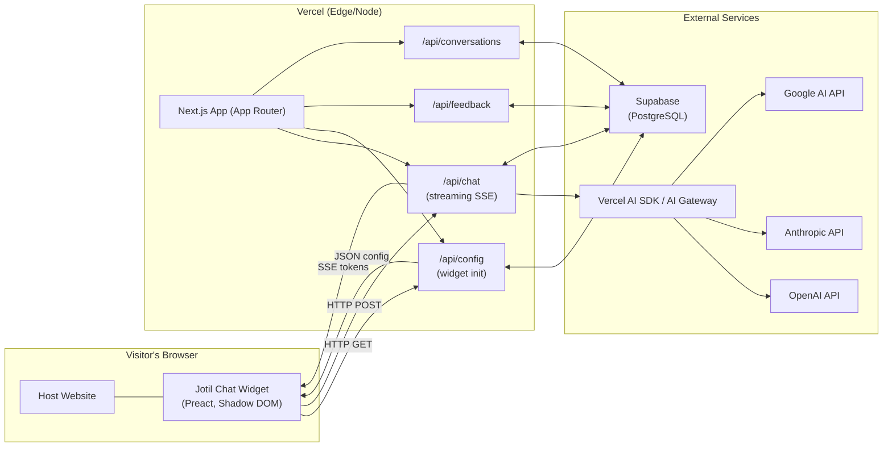
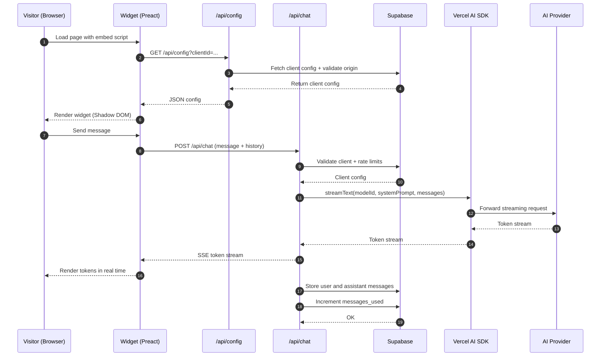
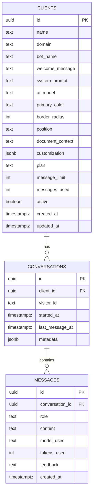
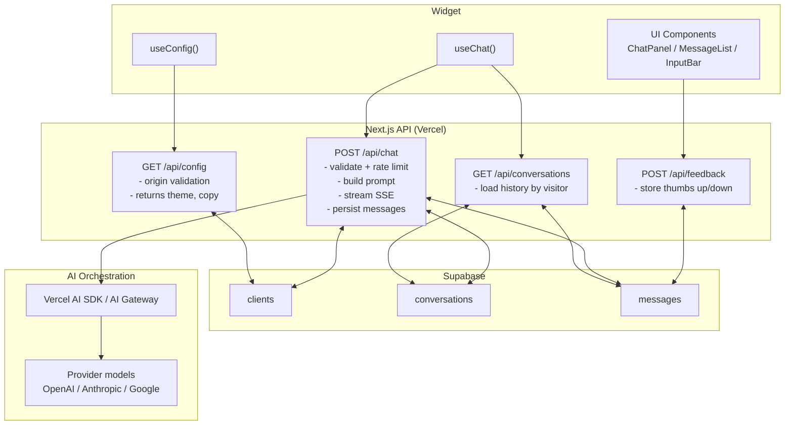
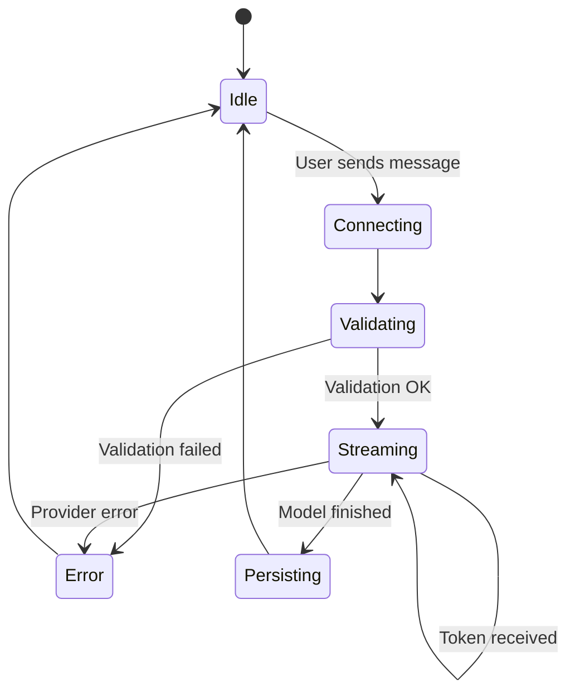

# Jotil Chat: Technical Architecture

**Version:** 1.0  
**Last Updated:** February 2026  
**Status:** Phase 1 (Productized Service, manual deployment per client)

---

## 1. Overview

Jotil Chat is an embeddable AI chat widget that businesses install on their websites via a single script tag. The system consists of three parts: a lightweight client-side widget, a Next.js backend that handles API routing and AI model orchestration, and a Supabase database for persistence.

The Vercel AI SDK is the core dependency for all AI interactions. It provides a unified interface across OpenAI, Anthropic, and Google models, handles streaming responses over Server-Sent Events (SSE), and allows model switching with a single configuration change per client.

---

## 2. Tech Stack

| Layer | Technology | Purpose |
|-------|-----------|---------|
| Widget (client-side) | Preact | Embeddable chat UI, under 50KB gzipped |
| Backend | Next.js (App Router) on Vercel | API routes, SSE streaming, admin pages (Phase 2) |
| AI Orchestration | Vercel AI SDK | Multi-provider model routing, streamText, token streaming |
| Database | Supabase (PostgreSQL) | Client configs, conversations, messages, usage tracking |
| Auth (Phase 2) | Supabase Auth | Client dashboard login |
| Payments (Phase 2) | Stripe | Subscription billing, usage metering |
| Hosting | Vercel | Zero-config deployment, Edge runtime for streaming |

---

## 3. System Architecture



### Request Flow

1. Visitor loads a webpage containing the Jotil Chat embed script.
2. The script fetches widget configuration from `/api/config?clientId=xxx` (colors, bot name, welcome message, position).
3. The script injects the Preact widget into the page inside a Shadow DOM container.
4. When the visitor sends a message, the widget POSTs to `/api/chat` with the message, conversation history, and client ID.
5. The backend looks up the client's configuration (AI model, system prompt, document context) from Supabase.
6. The backend calls the selected AI provider through the Vercel AI SDK's `streamText` function.
7. Tokens stream back to the widget over SSE. The widget renders them in real time.
8. After streaming completes, the backend writes the full message pair (user + assistant) to Supabase.



---

## 4. Project Structure

```
jotil-chat/
|-- .claude/
|   |-- CLAUDE.md                   # Claude Code project instructions
|   |-- skills/                     # Custom Claude Code skills
|-- src/
|   |-- app/
|   |   |-- api/
|   |   |   |-- chat/
|   |   |   |   |-- route.ts        # POST: streaming chat endpoint
|   |   |   |-- config/
|   |   |   |   |-- route.ts        # GET: widget configuration
|   |   |   |-- feedback/
|   |   |   |   |-- route.ts        # POST: message feedback (thumbs up/down)
|   |   |   |-- conversations/
|   |   |       |-- route.ts        # GET: conversation history
|   |   |-- (dashboard)/            # Phase 2: admin dashboard pages
|   |   |-- layout.tsx
|   |   |-- page.tsx
|   |-- lib/
|   |   |-- ai/
|   |   |   |-- providers.ts        # AI provider configuration (OpenAI, Anthropic, Google)
|   |   |   |-- prompts.ts          # System prompt builder (base + client context)
|   |   |   |-- models.ts           # Model registry (available models, defaults, pricing tier)
|   |   |-- db/
|   |   |   |-- supabase.ts         # Supabase client initialization
|   |   |   |-- queries.ts          # Database query functions
|   |   |-- utils/
|   |       |-- rate-limit.ts       # Rate limiting logic
|   |       |-- validation.ts       # Input validation and sanitization
|   |-- types/
|       |-- index.ts                # Shared TypeScript types
|-- widget/
|   |-- src/
|   |   |-- index.ts                # Widget entry point, embed script loader
|   |   |-- App.tsx                 # Root Preact component
|   |   |-- components/
|   |   |   |-- ChatPanel.tsx       # Open state: header + messages + input
|   |   |   |-- BubbleButton.tsx    # Collapsed state: floating button
|   |   |   |-- MessageList.tsx     # Scrollable message area
|   |   |   |-- MessageBubble.tsx   # Individual message (user or bot)
|   |   |   |-- TypingIndicator.tsx # Three-dot bounce animation
|   |   |   |-- InputBar.tsx        # Text input + send button
|   |   |   |-- ErrorMessage.tsx    # Inline error display
|   |   |-- hooks/
|   |   |   |-- useChat.ts          # Chat state management, SSE connection
|   |   |   |-- useConfig.ts        # Fetch and apply widget configuration
|   |   |-- styles/
|   |   |   |-- widget.css          # All widget styles (injected into Shadow DOM)
|   |   |-- utils/
|   |       |-- markdown.ts         # Safe markdown-to-HTML renderer
|   |       |-- contrast.ts         # Auto-contrast color calculation
|   |       |-- time.ts             # Relative timestamp formatting
|   |       |-- sound.ts            # Web Audio API notification sound
|   |-- build/                      # Compiled widget bundle (single JS file)
|   |-- vite.config.ts              # Widget build config (Preact, single-file output)
|-- supabase/
|   |-- migrations/                 # Database migration files
|   |-- seed.sql                    # Development seed data
|-- docs/
|   |-- technical-architecture.md   # This document
|   |-- widget-design-spec.md       # Widget UI/UX specification
|   |-- prompt-library.md           # System prompt templates
|   |-- onboarding-runbook.md       # Client setup checklist
|-- package.json
|-- tsconfig.json
|-- .env.local                      # Local environment variables (never committed)
|-- .env.example                    # Template for required env vars
```

---

## 5. Database Schema

All tables live in Supabase (PostgreSQL). Row Level Security (RLS) policies will be added in Phase 2 when the client dashboard is built.

### clients

Stores each paying client's account and widget configuration.

| Column | Type | Notes |
|--------|------|-------|
| id | uuid (PK) | Auto-generated |
| name | text | Business name |
| domain | text | Allowed origin domain for CORS |
| bot_name | text | Display name in widget header |
| welcome_message | text | First message shown to visitors |
| system_prompt | text | Base instructions for the AI |
| ai_model | text | Model identifier, e.g. "openai/gpt-5-nano" |
| primary_color | text | Hex color for widget theming |
| border_radius | integer | Widget corner radius in px |
| position | text | "bottom-right" or "bottom-left" |
| document_context | text | Optional reference content the AI uses for answers |
| customization | jsonb | Extensible widget options: `bubbleIconUrl`, `logoUrl`, `greetingMessage`, `glowEffect`, `botAvatarUrl`, `autoOpenDelay`, `greetingDelay`, `widgetSize`, `soundEnabled`, `darkMode` |
| plan | text | "starter", "pro", "agency", "enterprise" |
| message_limit | integer | Monthly message cap based on plan |
| messages_used | integer | Current month usage counter |
| active | boolean | Whether the widget is live |
| created_at | timestamptz | Account creation date |
| updated_at | timestamptz | Last modification date |

### conversations

Groups messages into distinct chat sessions per visitor.

| Column | Type | Notes |
|--------|------|-------|
| id | uuid (PK) | Auto-generated |
| client_id | uuid (FK) | References clients.id |
| visitor_id | text | Anonymous identifier (stored in visitor's localStorage) |
| started_at | timestamptz | When the conversation began |
| last_message_at | timestamptz | Updated on each new message |
| metadata | jsonb | Optional: visitor info, page URL, referrer |

### messages

Individual messages within a conversation.

| Column | Type | Notes |
|--------|------|-------|
| id | uuid (PK) | Auto-generated |
| conversation_id | uuid (FK) | References conversations.id |
| role | text | "user" or "assistant" |
| content | text | Message body |
| model_used | text | Which AI model generated the response (null for user messages) |
| tokens_used | integer | Token count for the response (null for user messages) |
| feedback | text | "positive", "negative", or null |
| created_at | timestamptz | Message timestamp |

### Indexes

- `conversations.client_id` -- fast lookup of all conversations for a client
- `conversations.visitor_id` -- resume conversations for returning visitors
- `messages.conversation_id` -- load conversation history
- `clients.domain` -- domain validation on API requests

### Seed Data

The `supabase/seed.sql` file should include a test client for local development and testing:

- Client name: "Test Coffee Shop"
- Domain: "localhost" (allows testing from local dev server)
- AI model: "openai/gpt-5-nano" (cheapest, fastest)
- A simple system prompt, welcome message, and primary color
- A few seed conversations and messages so the conversation history UI can be tested without sending real AI requests

The seed client ID should be a fixed, known UUID (e.g., `00000000-0000-0000-0000-000000000001`) so it can be hardcoded in test scripts and the widget dev server.




---

## 6. API Endpoints



### POST /api/chat

The primary endpoint. Receives a visitor's message, calls the AI, and streams the response.

**Request body:**
```json
{
  "clientId": "uuid",
  "conversationId": "uuid or null (creates new)",
  "visitorId": "string",
  "message": "string",
  "history": [
    { "role": "user", "content": "..." },
    { "role": "assistant", "content": "..." }
  ]
}
```

**Response:** SSE stream of tokens, using the Vercel AI SDK's `streamText` response format.

**Backend logic:**
1. Validate `clientId` exists and is active.
2. Check rate limit (per visitor IP and per client monthly usage).
3. Fetch client config from Supabase (cached in memory for the duration of the request; add Redis/Vercel KV caching if latency becomes an issue).
4. Build the full prompt: base system prompt + client's system prompt + document context + conversation history + new user message.
5. Call `streamText` from the Vercel AI SDK with the client's configured model.
6. Stream tokens back to the widget.
7. On stream completion, write user message and assistant message to the `messages` table. Increment `messages_used` on the `clients` table.

**Error handling:**
- Invalid client ID: 404
- Client inactive: 403
- Rate limited (visitor): 429 with retry-after header
- Monthly limit exceeded (client): 429 with specific message
- AI provider error: 502 with generic error message to visitor

### GET /api/config

Returns widget configuration for a given client. Called once when the widget loads.

**Query params:** `clientId=uuid`

**Response:**
```json
{
  "botName": "string",
  "welcomeMessage": "string",
  "primaryColor": "#hex",
  "borderRadius": 12,
  "position": "bottom-right",
  "bubbleIconUrl": "string | null",
  "logoUrl": "string | null",
  "greetingMessage": "string | null",
  "glowEffect": false,
  "starterQuestions": ["string"] | null,
  "showWatermark": true,
  "conversationExpiryHours": 24,
  "botAvatarUrl": "string | null",
  "autoOpenDelay": "number | null",
  "greetingDelay": 3,
  "widgetSize": "compact | standard | large",
  "soundEnabled": true,
  "darkMode": "light | dark | auto"
}
```

**Security:** Validates the request Origin header against the client's registered domain. Returns 403 if the origin does not match.

### POST /api/feedback

Stores thumbs-up or thumbs-down feedback on a specific message.

**Request body:**
```json
{
  "messageId": "uuid",
  "feedback": "positive" | "negative"
}
```

### GET /api/conversations

Returns conversation history for a given visitor. Used to restore chat when a returning visitor opens the widget.

**Query params:** `clientId=uuid&visitorId=string`

---

## 7. AI Model Routing

The Vercel AI SDK handles multi-provider routing through its unified interface. Each client's `ai_model` field stores a provider/model string that maps directly to the SDK's model resolution.

### Supported Models (Launch)

| Display Name | Model String | Provider | Default For |
|-------------|-------------|----------|-------------|
| GPT-5 Nano | openai/gpt-5-nano | OpenAI | Starter plan |
| GPT-5 | openai/gpt-5 | OpenAI | -- |
| Claude Haiku | anthropic/claude-haiku-4-5 | Anthropic | -- |
| Claude Sonnet | anthropic/claude-sonnet-4-5 | Anthropic | -- |
| Gemini Flash | google/gemini-2.0-flash | Google | -- |

### Provider Configuration

```typescript
// lib/ai/providers.ts
import { streamText } from 'ai';

export async function streamChatResponse(
  modelId: string,
  systemPrompt: string,
  messages: Message[]
) {
  const result = streamText({
    model: modelId,       // e.g. "openai/gpt-5-nano"
    system: systemPrompt,
    messages: messages,
    maxTokens: 1024,
    temperature: 0.7,
  });

  return result.toDataStreamResponse();
}
```

The Vercel AI SDK resolves the model string to the correct provider automatically through the Vercel AI Gateway. No manual provider initialization or API key routing is needed per-provider. All provider API keys are stored as environment variables on Vercel.

---

## 8. Widget Embed System

### How Clients Install the Widget

Each client receives a single script tag:

```html
<script
  src="https://chat.jotil.com/widget.js"
  data-client-id="CLIENT_UUID"
  async
></script>
```

### Widget Loading Sequence

1. The script loads asynchronously (does not block the host page).
2. On load, it reads the `data-client-id` attribute from its own script tag.
3. It creates a Shadow DOM container to isolate widget styles from the host page.
4. It fetches configuration from `/api/config?clientId=CLIENT_UUID`.
5. It renders the Preact app inside the Shadow DOM with the fetched configuration.
6. The widget starts in the collapsed state (floating bubble button).

### Shadow DOM Isolation

The widget uses Shadow DOM to prevent CSS conflicts between the widget and the host website. All widget styles are injected into the shadow root. No widget styles leak out. No host styles leak in.

### Build Output

The widget build process (Vite) produces a single JavaScript file that includes the Preact runtime, all components, and all CSS (injected via JS into the Shadow DOM). Target size: under 50KB gzipped (currently ~17KB).

---

## 9. Streaming Implementation

Token streaming is critical for a responsive chat experience. The implementation uses SSE through the Vercel AI SDK.



### Backend (Next.js API Route)

```typescript
// app/api/chat/route.ts
import { streamText } from 'ai';

export async function POST(req: Request) {
  const { clientId, message, history } = await req.json();

  // 1. Validate and fetch client config
  const client = await getClientConfig(clientId);

  // 2. Build messages array
  const messages = [
    ...history,
    { role: 'user', content: message }
  ];

  // 3. Stream response
  const result = streamText({
    model: client.aiModel,
    system: buildSystemPrompt(client),
    messages,
    maxTokens: 1024,
  });

  return result.toDataStreamResponse();
}
```

### Widget (Preact)

The widget reads the SSE stream and updates the UI token by token. It uses a custom `useChat` hook (not the Vercel AI SDK's `useChat`, since that is React-specific and we are using Preact). The hook manages:

- Opening an SSE connection to `/api/chat`
- Parsing incoming tokens from the Vercel AI SDK's data stream format
- Appending tokens to the current assistant message in state
- Auto-scrolling the message list as tokens arrive
- Handling errors and connection drops

---

## 10. Security

### CORS and Origin Validation

Every API request is validated against the client's registered domain. The `/api/chat` and `/api/config` endpoints check the `Origin` header and reject requests from unregistered domains.

### Input Sanitization

All user input is sanitized before being sent to the AI model. The widget trims whitespace and enforces a maximum message length (1000 characters). The backend validates input length again server-side.

### Markdown Rendering

Bot responses that contain markdown are rendered using a minimal, custom parser. No raw HTML from the AI model is ever injected into the DOM. The renderer only supports the safe subset defined in the Widget Design Spec (bold, italic, links, lists, inline code, code blocks, blockquotes). Links are validated to ensure they use http or https protocols only.

### Rate Limiting

Two layers of rate limiting:

1. **Per-visitor:** Maximum 20 messages per minute per IP address. Enforced in the API route using an in-memory store (upgrade to Vercel KV if needed at scale).
2. **Per-client monthly cap:** Based on the client's plan (e.g., 2,000 messages/month for Starter). Tracked in the `messages_used` column on the `clients` table.

### API Key Storage

All AI provider API keys (OpenAI, Anthropic, Google) are stored as Vercel environment variables. They are never exposed to the client-side widget or included in any API response.

---

## 11. Phase 1 Deployment (Manual, Per Client)

During Phase 1, there is one deployed instance of the Next.js app serving all clients. The app is multi-tenant by design: each request includes a `clientId` that determines configuration, model, and usage limits.

### Adding a New Client

1. Create a new row in the `clients` table with the client's configuration.
2. Provide the client with their embed script tag containing their unique `clientId`.
3. The client pastes the script tag on their website.
4. The widget is live.

There is no per-client deployment or code duplication. All clients share the same backend and widget code. Client-specific behavior is driven entirely by database configuration.

### Environment Variables

```
# .env.example
OPENAI_API_KEY=sk-...
ANTHROPIC_API_KEY=sk-ant-...
GOOGLE_AI_API_KEY=...
SUPABASE_URL=https://xxx.supabase.co
SUPABASE_SERVICE_ROLE_KEY=...
NEXT_PUBLIC_WIDGET_URL=https://chat.jotil.com
```

---

## 12. Performance Considerations

| Concern | Approach |
|---------|----------|
| Widget load speed | Single JS file under 50KB gzipped (~17KB currently), loaded async, Shadow DOM avoids layout recalculation |
| Time to first token | Edge runtime on Vercel for the /api/chat route minimizes cold start latency |
| Streaming smoothness | Tokens rendered via requestAnimationFrame, no React reconciliation overhead (Preact is lighter) |
| Database query latency | Client config can be cached in-memory or via Vercel KV after first fetch |
| Host page impact | Shadow DOM isolation, async loading, no main thread blocking |
| Message history growth | Paginate conversation loading, only send recent N messages as context to the AI (sliding window) |

---

## 13. Future Architecture (Phase 2 and Beyond)

These are not built in Phase 1 but the architecture accommodates them:

- **Admin Dashboard:** Next.js pages under `src/app/(dashboard)/`. Uses Supabase Auth for client login. Clients manage their bot config, view conversations, see analytics.
- **Agency Dashboard:** Multi-client view with role-based access. Agency users see all their clients' bots.
- **Document Upload (RAG):** Replace the plain-text `document_context` field with vector embeddings stored in Supabase pgvector. Use the Vercel AI SDK's embedding functions to index uploaded documents.
- **Human Handoff:** Add a `handoff_requested` flag on conversations. When triggered, send a webhook or email to the client. Phase 3 feature.
- **Webhooks:** Allow clients to receive conversation events (new message, conversation started, lead captured) via HTTP webhooks.
- **Lead Capture:** Configurable pre-chat form (name, email) stored in a `leads` table.

---

*This document describes the technical architecture for Jotil Chat. For UI/UX details, refer to the Widget Design Spec. For AI prompt design, refer to the Prompt Library. For client setup procedures, refer to the Customer Onboarding Runbook.*